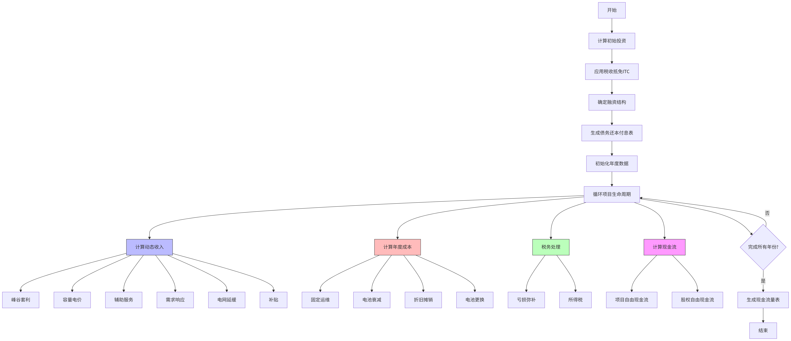
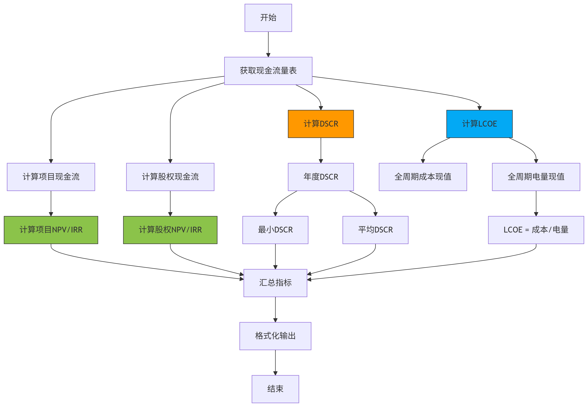
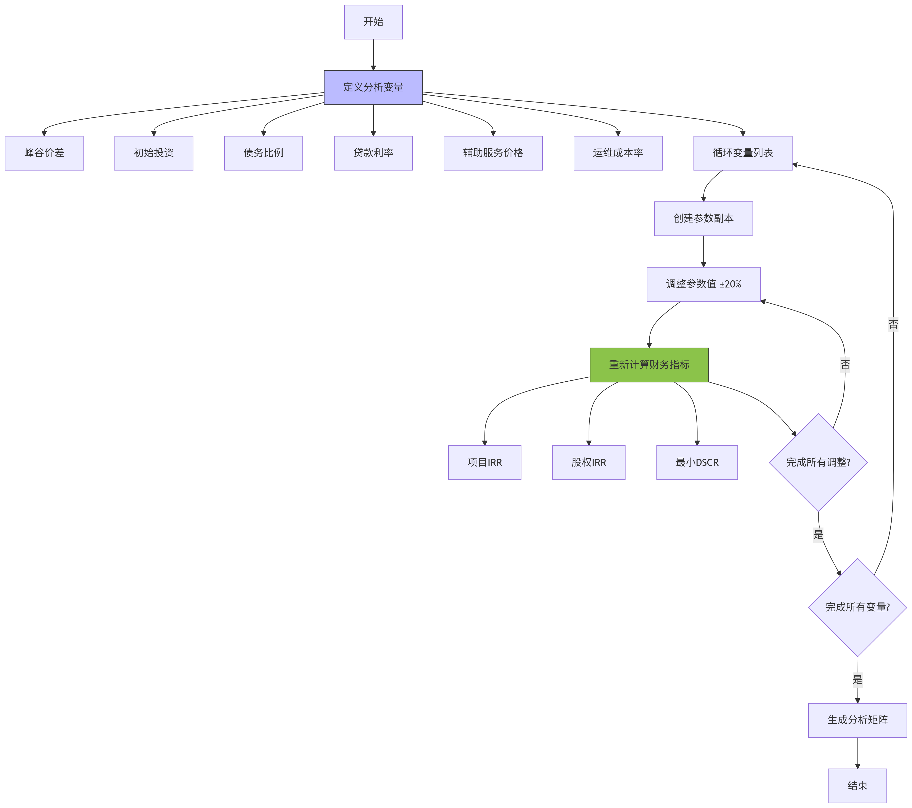

# 储能电站经济MCP工具技术报告 (V3 专家版)

## 1. 工具概述

本MCP工具是一个综合性的储能电站经济效益分析工具，能够对储能电站的多种盈利模式进行量化分析，计算关键财务指标，并生成详细的经济评估报告。V3专家版新增了融资结构分析、税务细节处理、动态效率衰减模型、蒙特卡洛风险模拟和扩展的敏感性分析等功能，提供更全面、更精准的项目经济评估。

该工具支持峰谷价差套利、容量电价收益、辅助服务市场收益、政府补贴收益、需求侧响应收益和延缓电网投资价值等多种盈利模式的计算，帮助用户评估储能项目的投资可行性。

## 2. 函数功能分析

### `_calculate_demand_response_revenue()`
- **功能**：计算需求侧响应年收益 (削峰填谷)
- **输入**：项目参数（技术规格、市场政策、财务假设等）
- **输出**：需求侧响应年收益
- **关键计算**：月度节省费用 = 需量电费 × 高峰负荷削减量

### `_calculate_grid_deferral_value()`
- **功能**：计算延缓电网投资的年化价值
- **输入**：项目参数
- **输出**：延缓电网投资年化价值
- **关键计算**：通过资本回收系数将一次性投资转化为年金

### `_calculate_detailed_annual_costs()`
- **功能**：计算更详细的年度运营成本
- **输入**：项目参数
- **输出**：包含基础运维成本、土地租赁成本和保险成本的字典
- **关键计算**：总固定运维成本 = 基础运维成本 + 土地租赁成本 + 保险成本

### `_calculate_debt_service_schedule()`
- **功能**：计算债务还本付息表
- **输入**：项目参数和贷款金额
- **输出**：包含年度还本付息计划的DataFrame
- **支持的还款方式**：等额本息、等额本金

### `_calculate_depreciation()`
- **功能**：计算不同折旧方法下的折旧额
- **输入**：项目参数、净投资、年份和累计折旧
- **输出**：当年折旧额
- **支持的折旧方法**：直线折旧法、双倍余额递减法

### `_apply_tax_credits()`
- **功能**：应用投资税收抵免(ITC)
- **输入**：项目参数和初始投资净额
- **输出**：税收抵免金额
- **关键计算**：税收抵免 = 初始投资净额 × 投资税收抵免率

### `_generate_dynamic_yearly_cashflow_statement()`
- **功能**：生成考虑了税收、效率衰减、融资结构和税务政策的动态年度现金流量表
- **输入**：项目参数
- **输出**：包含详细年度财务数据的DataFrame、贷款金额、股权金额和ITC抵免
- **关键特性**：考虑效率衰减、亏损弥补、债务偿付等动态因素

### `_calculate_financial_metrics_v3()`
- **功能**：基于动态现金流量表计算最终财务指标
- **输入**：项目参数、现金流量表、贷款金额、股权金额和ITC抵免
- **输出**：包含项目NPV、项目IRR、股权NPV、股权IRR、DSCR和LCOE的字典

### `_perform_monte_carlo_simulation()`
- **功能**：执行蒙特卡洛模拟进行风险评估
- **输入**：项目参数和模拟次数
- **输出**：包含风险评估结果的字典
- **关键输出**：平均IRR、IRR标准差、不同百分位的IRR值、IRR超过折现率的概率

### `_perform_expanded_sensitivity_analysis()`
- **功能**：执行扩展的敏感性分析
- **输入**：项目参数
- **输出**：包含不同变量敏感性分析结果的字典
- **分析的变量**：峰谷价差、初始投资、债务比例、贷款利率、辅助服务价格、运维成本率

### `analyze_storage_station_economics_expert()`
- **主入口函数**
- **功能**：协调所有计算，生成最终专家报告
- **输入**：完整项目参数
- **输出**：包含经济分析结果的综合报告
- **关键特性**：整合了动态现金流量表、财务指标计算、风险评估和敏感性分析

### 辅助函数
- `_calculate_capacity_tariff_revenue()`: 计算容量电价收入
- `_calculate_ancillary_services_revenue()`: 计算辅助服务收入
- `_calculate_subsidy_revenue()`: 计算补贴收入
- `_calculate_peak_valley_arbitrage_v2()`: 计算峰谷价差套利收益

## 3. 工具流程图说明

以下是工具各个核心功能的流程图：

### 整体流程


### 动态现金流量表生成


### 财务指标计算


### 蒙特卡洛模拟


### 敏感性分析


工具流程说明：
1. 用户输入完整的项目参数（项目信息、成本结构、技术规格、市场政策和财务假设）
2. 工具调用各个子函数分别计算：
   - 峰谷价差套利收益
   - 容量电价收益
   - 辅助服务收益
   - 需求侧响应收益
   - 延缓电网投资价值
   - 政府补贴收益
   - 详细年度运营成本
3. 生成考虑了效率衰减、税收政策和融资结构的动态现金流量表
4. 基于动态现金流量表，计算关键财务指标（NPV、IRR、DSCR、LCOE）
5. 执行蒙特卡洛风险模拟和敏感性分析
6. 生成包含项目评估结论、财务指标、风险评估和敏感性分析的综合报告

## 4. 使用方法

### 项目参数配置示例

```python
project_parameters = {
        "project_info": {
            "name": "江苏虚拟电厂储能项目 (专家模拟)", 
            "location": "江苏", 
            "project_type": "用户侧+虚拟电厂"
        },
        "cost_structure": {
            "total_investment_usd": 20000000, 
            "battery_replacement_cost_usd": 8000000,
            "battery_replacement_year": 8, 
            "annual_opex_rate_of_investment": 0.01,
            "annual_land_lease_usd": 50000, 
            "annual_insurance_rate_of_investment": 0.005,
            "investment_tax_credit_rate": 0.10  # 10%的投资税收抵免
        },
        "technical_specs": {
            "capacity_mwh": 40, 
            "max_power_mw": 20, 
            "round_trip_efficiency": 0.90,
            "depth_of_discharge_dod": 0.90, 
            "cycle_life": 8000, 
            "lifespan_years": 15,
            "annual_efficiency_degradation": 0.015  # 每年效率衰减1.5%
        },
        "market_and_policy": {
            "peak_valley_price_diff_usd_per_kwh": 0.11,
            "capacity_price_usd_per_mw_year": 20000,
            "ancillary_service_revenue_usd_per_mw_year": 45000,
            "subsidy_per_kwh_discharged_usd": 0.005,
            "demand_response": {
                "is_participant": True, 
                "demand_charge_usd_per_kw_month": 5, 
                "peak_load_reduction_kw": 1000
            },
            "grid_deferral": {
                "is_applicable": False, 
                "deferred_investment_usd": 5000000, 
                "deferral_period_years": 5
            }
        },
        "financial_assumptions": {
            "discount_rate": 0.08, 
            "equity_discount_rate": 0.10,
            "charge_cycles_per_day": 1.5,
            "vat_rate": 0.13, 
            "income_tax_rate": 0.25,
            "depreciation_method": "double_declining",  # 双倍余额递减法
            "financing": {
                "debt_ratio": 0.70,  # 70%债务融资
                "loan_interest_rate": 0.06,
                "loan_term_years": 10,
                "repayment_type": "equal_installment"  # 等额本息
            },
            "monte_carlo": {
                "peak_valley_price_diff": {"mean": 0.11, "std_dev": 0.02},
                "initial_investment": {"mean": 20000000, "std_dev": 1500000},
                "debt_ratio": {"mean": 0.70, "std_dev": 0.05}
            }
        }
    }
```

### 提示词示例

使用该工具时，您可以提供以下类型的提示词来获取特定分析：

#### 1. 基础分析
"请使用analyze_storage_station_economics_expert函数分析江苏虚拟电厂储能项目的经济效益，参数按照项目参数配置示例，生成包含动态现金流、财务指标、风险评估和敏感性分析的完整专家报告。"

"请对40MWh/20MW的用户侧储能项目进行全面经济评估，考虑效率衰减、融资结构和税务政策，输出项目NPV、IRR、DSCR和LCOE等关键指标。"

#### 2. 单个盈利模式分析
"请重点分析需求侧响应收益对江苏虚拟电厂储能项目经济效益的影响，计算该模式下的年净收益、占总收益的比例，并评估需量电费和负荷削减量变化对项目可行性的敏感度。"

"请单独计算延缓电网投资价值对项目IRR的贡献，假设延缓电网投资金额为500万美元， deferral_period为5年，分析其对项目整体收益的影响。"

"请分析峰谷价差套利模式（考虑效率衰减）对项目现金流的影响，模拟峰谷价差从0.08美元/kWh到0.15美元/kWh变化时，项目NPV和IRR的变化情况。"

#### 3. 融资结构与税务分析
"请分析不同债务比例（50%、60%、70%、80%）对江苏虚拟电厂储能项目股权IRR和DSCR的影响，考虑等额本息和等额本金两种还款方式，推荐最优融资结构。"

"请评估贷款利率变化（4%、5%、6%）对项目财务指标的影响，分析项目对利率波动的敏感性，并计算利息保障倍数。"

"请计算投资税收抵免(ITC)对项目现金流的影响，假设ITC率为10%，分析其对项目NPV和投资回收期的改善作用。"

#### 4. 风险评估与敏感性分析
"请对江苏虚拟电厂储能项目进行蒙特卡洛风险模拟（1000次迭代），基于峰谷价差、初始投资和债务比例的不确定性，评估项目IRR、DSCR的概率分布和风险水平，输出IRR<8%的概率。"

"请执行扩展敏感性分析，测试峰谷价差、初始投资、债务比例、贷款利率、辅助服务价格和运维成本率等变量变化±20%时，对项目IRR和DSCR的影响，生成 tornado diagram。"

#### 5. 多场景对比
"请分别计算独立储能电站和虚拟电厂聚合储能两种模式下的经济效益，假设虚拟电厂模式下容量利用率提高30%、辅助服务收益增加50%，对比分析两种模式的NPV、IRR和LCOE差异。"

"请对比分析不同折旧方法（直线折旧法vs双倍余额递减法）对项目所得税和现金流的影响，评估哪种方法更有利于提高项目IRR。"

#### 6. 参数优化
"请针对40MWh/20MW的储能项目，优化充放电次数（1-2次/天）和放电深度（80%-95%），以最大化股权IRR，提供最优参数组合和对应的财务指标。"

"请优化电池更换策略，分析在第7年、第8年或第9年更换电池对项目整体经济效益的影响，考虑更换成本和剩余价值，推荐最佳更换时机。"

#### 7. 动态效率衰减分析
"请分析不同效率衰减率（0.5%/年、1.0%/年、1.5%/年）对储能项目全生命周期收益的影响，评估效率衰减对LCOE的敏感性。"

"请模拟电池性能退化对峰谷价差套利收益的逐年影响，计算各年收益衰减情况，并评估其对项目IRR的整体影响。"

## 5. 输出结果说明

工具输出的分析报告包含以下主要部分：

- **项目信息**：项目名称、位置和类型
- **评估总结**：项目可行性 verdict、项目NPV、项目IRR、股权NPV、股权IRR、最小DSCR、平均DSCR、平准化储能成本(LCOE)
- **风险评估**：蒙特卡洛模拟结果，包括平均IRR、IRR标准差、不同百分位的IRR值、IRR超过折现率的概率
- **敏感性分析**：不同变量（峰谷价差、初始投资等）变化对项目IRR和DSCR的影响
- **详细财务报表**：年度现金流量表，包含收入、成本、利润、现金流等详细数据
