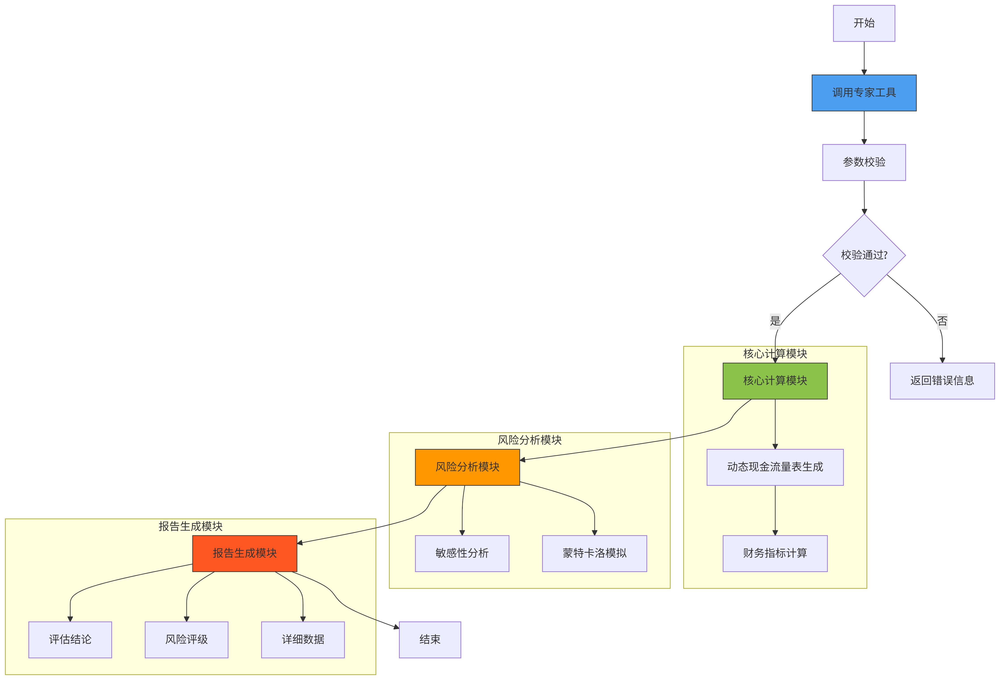

# 储能电站经济MCP工具技术报告

## 1. 工具概述

本MCP工具是一个综合性的储能电站经济效益分析工具，能够对储能电站的多种盈利模式进行量化分析，计算关键财务指标，并生成详细的经济评估报告。该工具支持峰谷价差套利、容量电价收益、辅助服务市场收益、政府补贴收益等多种盈利模式的计算，帮助用户评估储能项目的投资可行性。

## 2. 函数功能分析

### `_calculate_peak_valley_arbitrage()`
- **功能**：计算峰谷价差套利年收益
- **输入**：项目参数（技术规格、市场政策、财务假设等）
- **输出**：包含毛收入、电池损耗成本和净收益的字典
- **关键计算**：
  - 日有效能量 = 容量 × 放电深度
  - 日收益 = 峰谷价差 × 日能量
  - 年收益 = 日收益 × 365 × 日充放电次数
  - 电池损耗成本 = 电池更换成本 / 循环寿命 × 年循环次数

### `_calculate_capacity_tariff_revenue()`
- **功能**：计算容量电价年收益
- **输入**：项目参数
- **输出**：容量电价年收益
- **关键计算**：容量电价 × 最大功率

### `_calculate_ancillary_services_revenue()`
- **功能**：计算辅助服务年收益
- **输入**：项目参数
- **输出**：辅助服务年收益
- **关键计算**：辅助服务单价 × 最大功率

### `_calculate_subsidy_revenue()`
- **功能**：计算政府补贴年收益
- **输入**：项目参数
- **输出**：补贴年收益
- **关键计算**：补贴单价 × 年放电量

### `_calculate_annual_costs()`
- **功能**：计算年度运营成本
- **输入**：项目参数
- **输出**：年度运营总成本
- **关键计算**：总投资 × OPEX比例

### `_calculate_financial_metrics()`
- **功能**：计算核心财务指标
- **输入**：项目参数和年净现金流
- **输出**：包含回收期、NPV、IRR和LCOE的字典
- **关键计算**：
  - 静态回收期 = 初始投资 / 年净现金流
  - NPV = 现金流折现值总和
  - IRR = 内部收益率
  - LCOE = 全生命周期成本 / 总放电量

### `analyze_storage_station_economics()`
- **主入口函数**
- **功能**：协调所有计算，生成最终报告
- **输入**：完整项目参数
- **输出**：包含经济分析结果的综合报告

## 3. 工具流程图说明



工具流程说明：
1. 用户输入完整的项目参数（项目信息、成本结构、技术规格、市场政策和财务假设）
2. 工具调用各个子函数分别计算：
   - 峰谷价差套利收益
   - 容量电价收益
   - 辅助服务收益
   - 政府补贴收益
   - 年度运营成本
3. 汇总计算总营收和总成本，得到年净现金流
4. 基于年净现金流和项目参数，计算关键财务指标（回收期、NPV、IRR、LCOE）
5. 生成包含项目评估结论、财务指标和详细分析的综合报告

## 4. 使用方法

### 项目参数配置示例

```python
project_parameters = {
    "project_info": {
        "name": "宁夏共享储能项目 (模拟)",
        "location": "宁夏",
        "project_type": "电网侧共享储能"
    },
    "cost_structure": {
        "total_investment_usd": 15000000,  # 总投资，1500万美元
        "battery_replacement_cost_usd": 7000000, # 电池更换成本
        "annual_opex_rate_of_investment": 0.015 # 年运维成本比例1.5%
    },
    "technical_specs": {
        "capacity_mwh": 20, # 额定容量20MWh
        "max_power_mw": 10, # 额定功率10MW
        "round_trip_efficiency": 0.88, # 充放电效率88%
        "depth_of_discharge_dod": 0.90, # 放电深度90%
        "cycle_life": 6000, # 循环寿命6000次
        "lifespan_years": 15 # 项目寿命15年
    },
    "market_and_policy": {
        "peak_valley_price_diff_usd_per_kwh": 0.12, # 峰谷价差0.12美元/kWh
        "capacity_price_usd_per_mw_year": 50000, # 容量电价5万美元/MW/年
        "ancillary_service_revenue_usd_per_mw_year": 30000, # 辅助服务3万美元/MW/年
        "subsidy_per_kwh_discharged_usd": 0.01 # 度电补贴0.01美元/kWh
    },
    "financial_assumptions": {
        "discount_rate": 0.08, # 折现率8%
        "charge_cycles_per_day": 1 # 每日充放电次数1次
    }
}
```

### 提示词示例

使用该工具时，您可以提供以下类型的提示词来获取特定分析：

#### 1. 基础分析
"请使用analyze_storage_station_economics函数分析宁夏共享储能项目的经济效益，参数按照默认配置，生成完整的经济评估报告。"

#### 2. 单个盈利模式分析
"请重点分析峰谷价差套利模式对宁夏共享储能项目经济效益的影响，计算该模式下的年净收益、占总收益的比例，并评估峰谷价差变化对项目可行性的敏感度。"

"请单独计算辅助服务市场收益对项目IRR的贡献，假设辅助服务年收入从2万美元/MW/年增加到4万美元/MW/年，分析其对项目回收期的影响。"

"请评估容量电价机制对项目财务指标的影响，比较有无容量电价情况下的NPV和IRR差异。"

#### 3. 所有盈利模式综合分析
"请对宁夏共享储能项目的所有盈利模式（峰谷价差套利、容量电价、辅助服务、政府补贴）进行综合分析，计算各模式的收益占比，评估项目整体的经济可行性，并给出优化建议。"

#### 4. 敏感性分析
"请调整峰谷价差为0.15美元/kWh，重新计算项目的NPV和IRR，并与基准 scenario 对比。"

"请分析电池循环寿命从6000次减少到4000次时，对项目LCOE和投资回收期的影响。"

"请模拟政府补贴取消的情景，评估项目在无补贴情况下的经济可行性。"

#### 5. 多场景对比
"请分别计算独立储能电站和共享储能电站两种模式下的经济效益，假设共享模式下容量利用率提高30%，对比分析两种模式的NPV、IRR和LCOE差异。"

"请对比分析电网侧储能和用户侧储能两种应用场景的经济指标差异，假设用户侧储能的峰谷价差为0.2美元/kWh，而电网侧储能可获得容量电价补贴。"

#### 6. 参数优化
"请针对20MWh/10MW的储能项目，优化充放电次数和放电深度，以最大化IRR，提供最优参数组合和对应的财务指标。"

"请优化电池更换策略，分析在第5年、第8年或第10年更换电池对项目整体经济效益的影响，推荐最佳更换时机。"

## 5. 输出结果说明

工具输出的分析报告包含以下主要部分：

- **项目信息**：项目名称、位置和类型
- **评估总结**：项目可行性 verdict、回收期、NPV、IRR和LCOE
- **详细分析**：年收入明细、年成本明细和年净现金流
